# ColezTrades — Trading Strategy

**Steps, Rules & Checklist**

> This document is a plain-English explanation of the *ColezTrades Trading Strategy*
> deck (18 slides). It is a **discretionary, level-based FX trading playbook**: find
> high-probability price areas ("Points of Interest"), wait for the **VuManChu**
> indicator to confirm a reaction, then enter with a defined stop, target and risk.
> All chart screenshots below are reproduced from the original deck (GBP/USD on
> TradingView / IC Markets).

> **Honest framing (project context).** Almost every technique in this deck —
> support/resistance, Fibonacci retracement, volume-profile levels, oscillator
> divergence — is **practitioner folklore**, not a replicated, after-cost edge. The
> one durable idea in it is the **risk-management discipline** (Step 3 / the rules):
> fixed-fractional risk, defined stops, partial profits, and no revenge trading.
> Treat this as a *process/checklist* for consistent discretionary execution, not as
> a proven statistical edge.

The strategy is organised into **five steps**:

1. Identifying key levels & Points of Interest
2. Identifying potential trades with VuManChu
3. Entering trades & risk management
4. Checklists
5. Hints, tips & additional information

---

## Step 1 — Identifying Key Levels & Points of Interest

### 1a. Marking out key levels

The first job is to map where price is *likely to react*. Three independent
sources of levels are layered onto the chart:

**Market structure & volume**
- **Market-structure levels** — higher-timeframe (Daily, H4) swing highs/lows and
  rejection points, drawn as horizontal rays.
- **High-volume levels** — read from a **Volume Profile**:
  - **POC** (Point of Control) — the price with the most traded volume
  - **VAH / VAL** (Value Area High / Low) — the edges of the ~70% value area
  - **HVN** (High-Volume Nodes) — local volume shelves that tend to act as S/R

  *Tools:* Fixed Range Volume Profile, Session Volume Indicator HD, Horizontal Rays.

**Fibonacci levels** — using a recent structural high and low, the Fib
retracement tool projects likely pullback levels:
- **Buys:** pull the Fib tool from the **low → high**
- **Sells:** pull the Fib tool from the **high → low**

  Key levels to watch: the **Golden Pocket (0.618–0.65)**, the **0.786**, and the **0.5**.

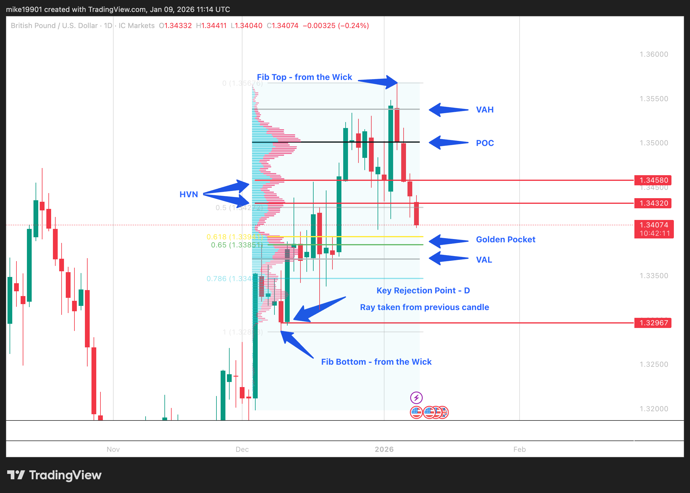

*Daily GBP/USD showing the Fib grid drawn "from the wick" (top 0 to bottom 1),
the Volume Profile with POC/VAH/VAL/HVN labelled, and a horizontal ray taken from
a previous candle marking a key daily rejection point.*

### 1b. Marking out Points of Interest (POIs)

A **Point of Interest (POI)** is an area where **multiple key levels overlap
(confluence)**. The logic is simple:

> **More confluences → greater chance price reacts to that area.**

In the worked example, a single zone lines up:
- a **4H rejection level**,
- the **Volume POC**, and
- the **Fibonacci Golden Pocket**.

Higher-timeframe confluence (4H > 1H) carries more weight. Once identified, the
POI is boxed with the **rectangle tool** so it's easy to watch as price
approaches.

<table>
<tr>
<td>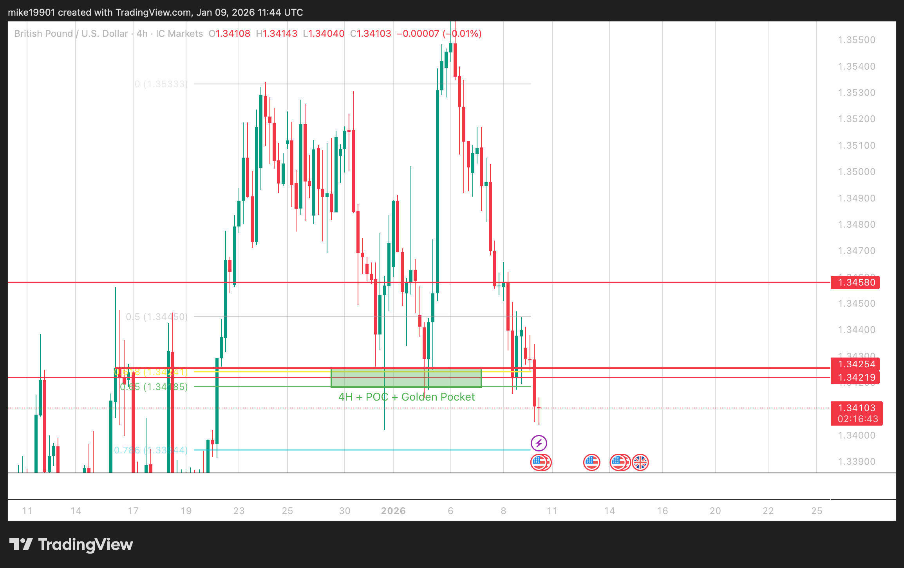</td>
<td>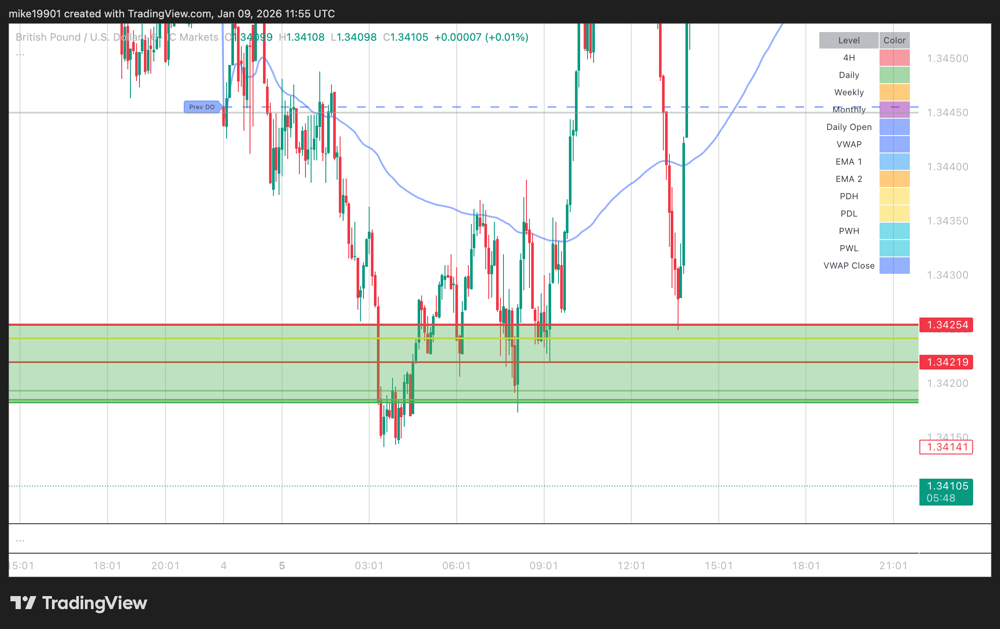</td>
<td>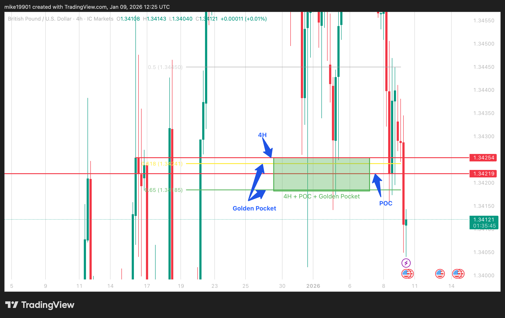</td>
</tr>
</table>

*Left → right: (1) the overlap of **4H structure + POC + Golden Pocket**; (2) the
intersecting levels that define the confluence; (3) the finished **POI** drawn as a
rectangle, now a zone to watch for a reaction.*

---

## Step 2 — Identifying Potential Trades & VuManChu

### 2a. Where trades come from

The POIs from Step 1 are the *only* places trades are considered. As price
approaches a POI, the **VuManChu Cipher B** indicator is used to look for a
reaction via three readings:

- **Volume divergence**
- **VWAP crosses / VWAP divergence**
- **Money Flow**

### 2b. Reading the VuManChu indicator

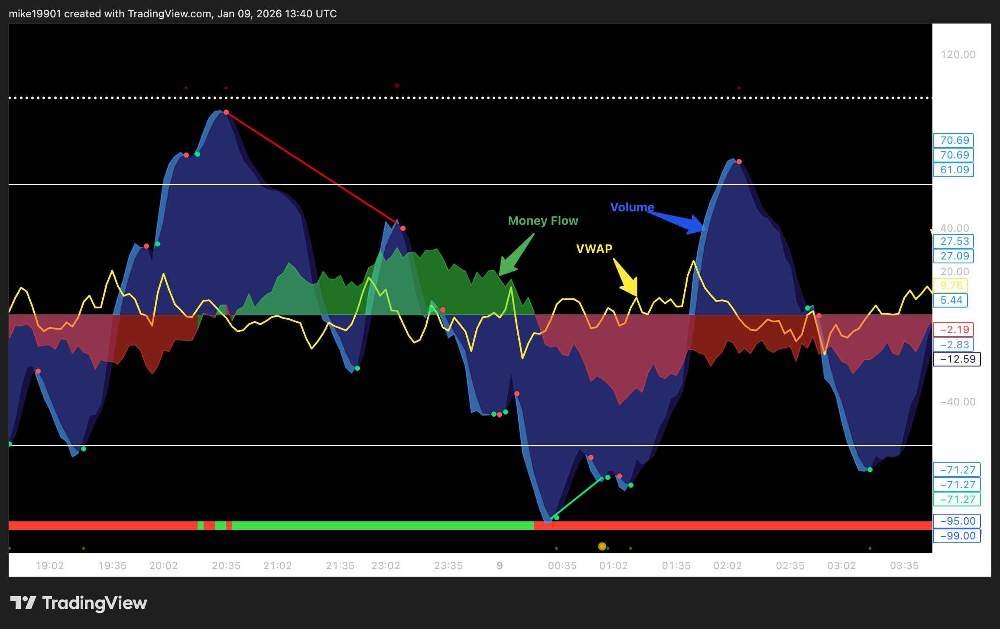

The three components:

| Component | Appearance | Meaning |
|---|---|---|
| **Volume (WaveTrend)** | Oscillating **blue** wave | Volume/energy of each market move — **larger waves = greater volume** in that move |
| **VWAP** | **Yellow** line | Pressure / momentum / trend change as it crosses the zero line — **above zero = bullish, below zero = bearish** |
| **Money Flow** | **Red / green** waves | Direction & strength of money flow — **green = flowing up, red = flowing down** |

### 2c. The three signals (sell vs buy)

<table>
<tr>
<td>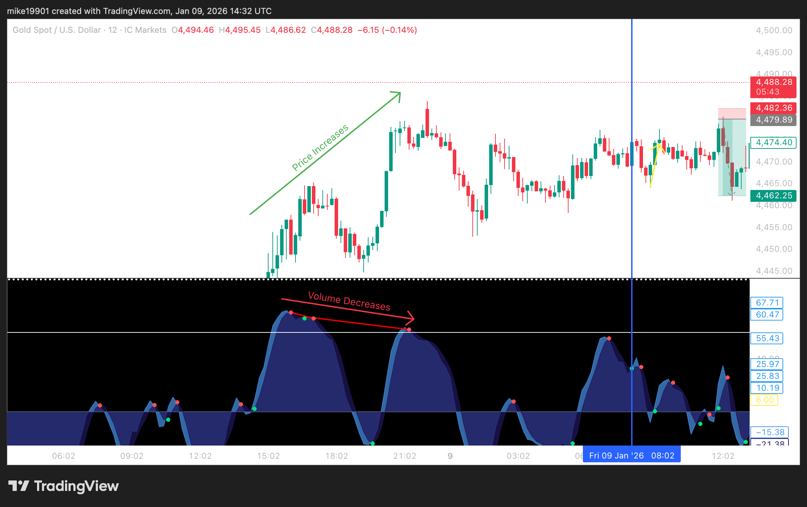</td>
<td>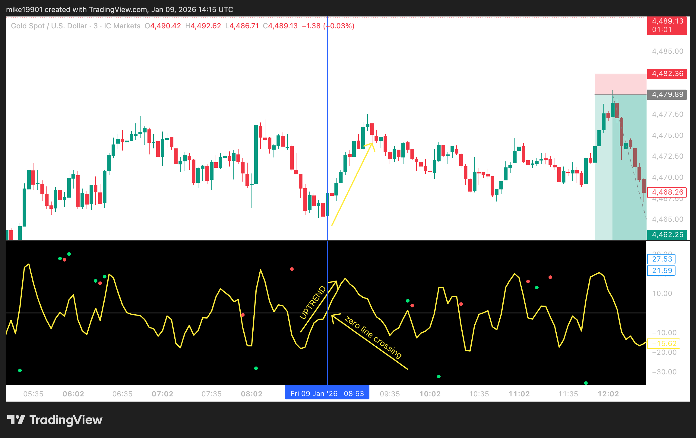</td>
<td>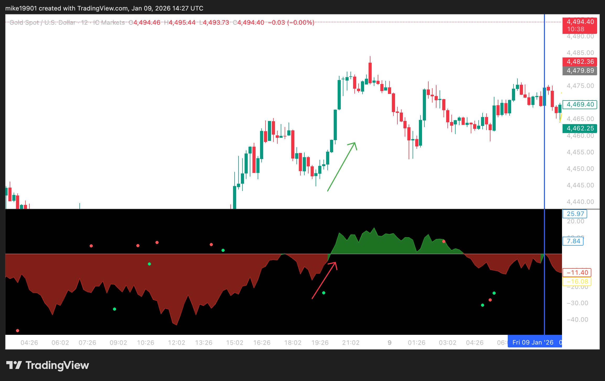</td>
</tr>
</table>

| Signal | Sell setup | Buy setup |
|---|---|---|
| **Volume divergence** | Volume waves **shrink to the upside** but price keeps making **new highs** | Volume waves **shrink to the downside** but price keeps making **new lows** |
| **VWAP** | VWAP **crossing or sharply trending down** to the zero line | VWAP **crossing or sharply trending up** to the zero line |
| **Money Flow** | Money Flow **green and trending toward zero** (momentum fading up) | Money Flow **red and trending toward zero** (momentum fading down) |

> **Divergence** = price and the indicator disagree (price makes a new
> high/low, the indicator does not). It's the core "the move is running out of
> fuel" tell used here.

### 2d. Confluence = confirmation

As with POIs, **the more VuManChu signals agree, the higher the probability**
the trade works. All three aren't required, but the **ideal** conditions are:

**Selling opportunity**
- Volume waves **decreasing to the upside**
- VWAP **trending sharply down** or crossing the zero line
- Money Flow **green and trending down** / crossing zero

**Buying opportunity**
- Volume waves **decreasing to the downside**
- VWAP **trending sharply up** or crossing the zero line
- Money Flow **red and trending up** / crossing zero

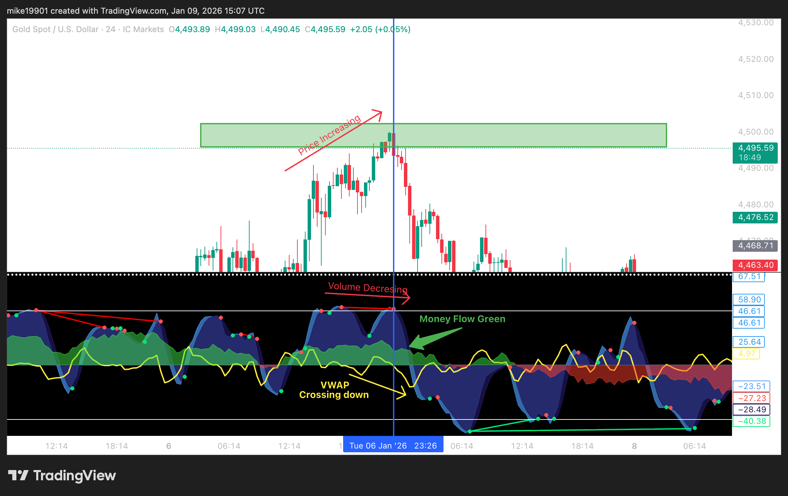

*VuManChu confluences are used as the **trigger** to enter at a POI — the POI says
"where", VuManChu says "now".*

---

## Step 3 — Entering Trades & Risk Management

### 3a. Trade makeup

Once price reaches a POI **and** VuManChu confirms a reaction, the trade is
marked up. Every trade has three parts: a **stop loss**, an **entry**, and a
**profit target**.

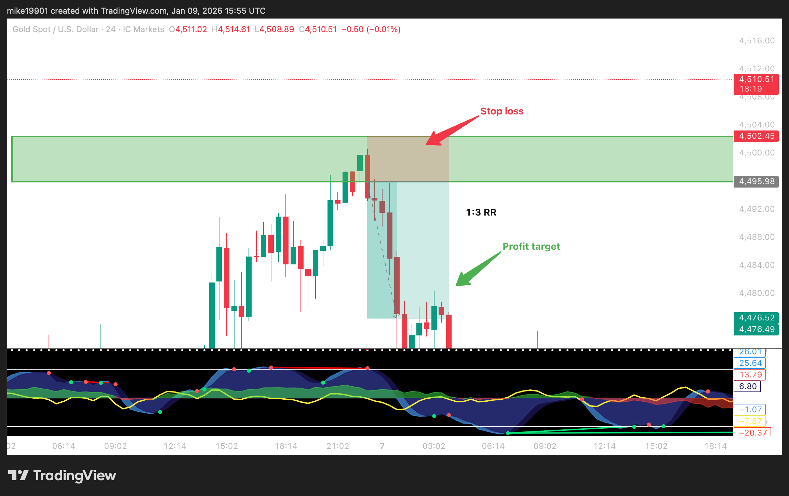

**Stop loss**
- Placed **above (for sells) or below (for buys)** the POI or recent market
  structure (recent highs/lows).
- **Smaller stop → larger position size**, but a greater chance of being stopped out.
- **Larger stop → smaller position size**, but more breathing room.

**Profit target**
- Placed to hit a chosen **risk-to-reward (RR)** ratio:
  - **1:1 RR** → 10-pip stop / 10-pip target
  - **1:2 RR** → 10-pip stop / 20-pip target
  - **1:3 RR** → 10-pip stop / 30-pip target
- Always check for **prior market structure** between entry and target — it can
  act as support/resistance and cap the move.

### 3b. Order types

<table>
<tr>
<td>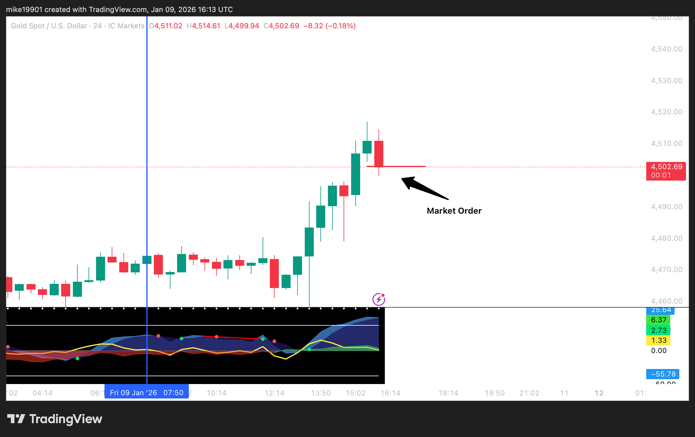</td>
<td>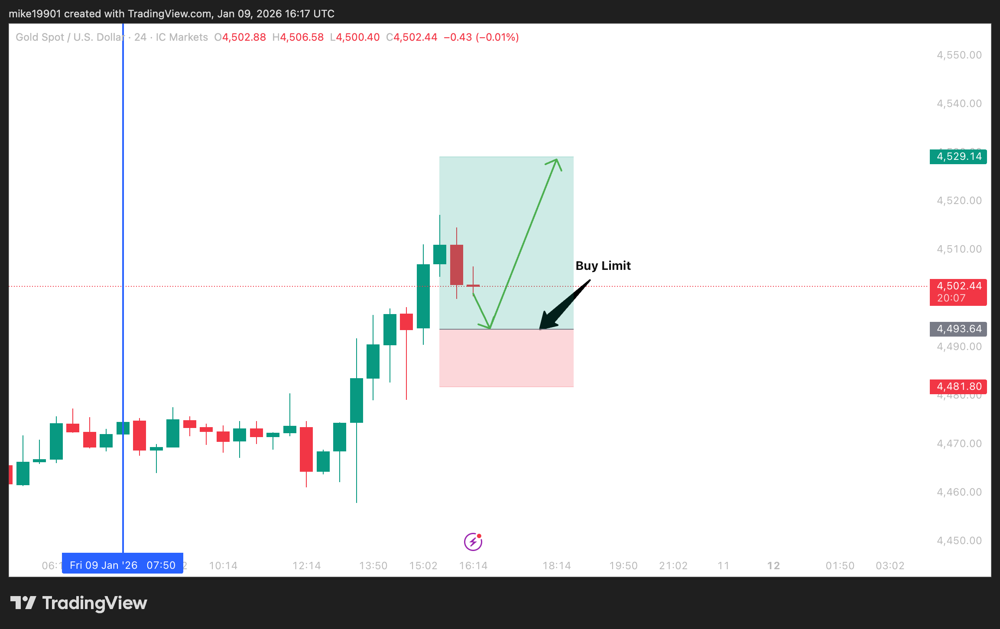</td>
<td>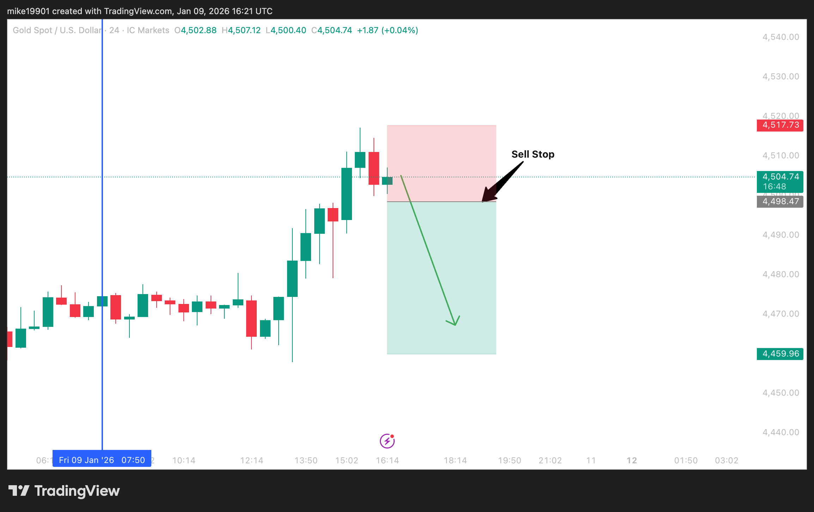</td>
</tr>
</table>

| Order type | How it works |
|---|---|
| **Market order** | Enter immediately at the current market price |
| **Sell limit** | Placed **above** current price; fills when price rises to the level |
| **Buy limit** | Placed **below** current price; fills when price falls to the level |
| **Sell stop** | Placed **below** current price; fills as price falls through the level |
| **Buy stop** | Placed **above** current price; fills as price rises through the level |

### 3c. Risk management

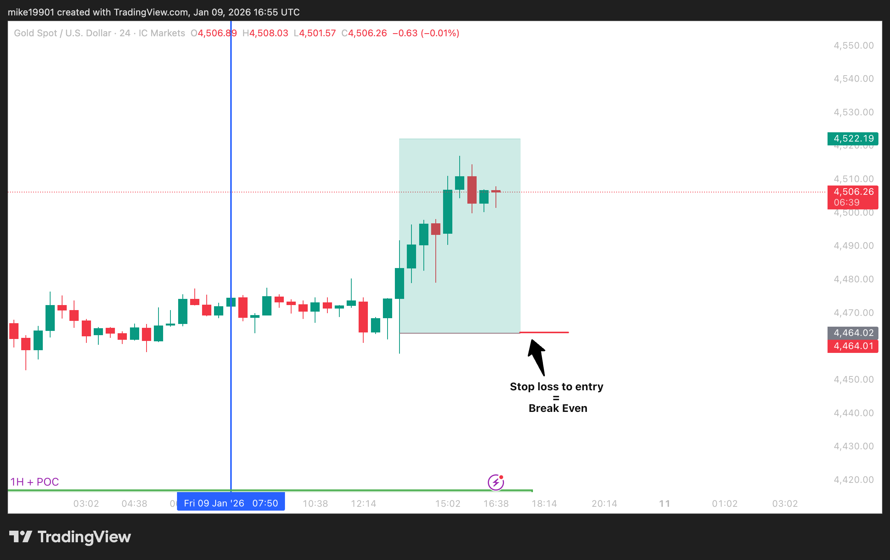

**Position sizing** is set by **stop-loss size, account size and risk %** (use a
position-size calculator; it also varies by instrument):

> **Example:** £1,000 account · 1% risk · 10-pip stop → **£10 risked** on the trade.

**Lot sizes** follow from the risk amount and stop size — each instrument needs a
different lot size to keep a £10 risk / 10-pip stop.

**Trade management** (key to protecting the account and locking in profit):
- Move the stop to **break-even (BE)** — or **trail** it — once in profit.
- Take **partial profits** as price reaches key profit levels.

---

## Step 4 — Checklists

### 4a. Chart mark-up & trading rules

**Marking up the chart**
- HTF rejection levels using **horizontal rays**
- **POC & HVN** levels using the Volume Range Profile
- **NPOCs** (naked/untested POCs) using the Session Volume Indicator HD
- HTF & LTF **Fibonacci** levels
- **Trend lines**
- Identify **POIs** and mark them with the rectangle tool
- Plan potential trades — **stop-loss levels** and **profit targets**

**Trading rules**
- Trades sized to a fixed **account risk %** (0.5%, 1%) or set amount
- Trades **only** taken when price is approaching a marked-out **POI**
- Trades planned to the chosen **RR ratio**
- Trades executed **only after confirmations**
- Stop moved to **BE once profit reaches 1:1**
- **Partial profits** taken at 1:1, 1:2, 1:3 — leave a runner with a trailing stop
- **No trading straight after a loss** (no revenge trading)

### 4b. Sell trade checklist

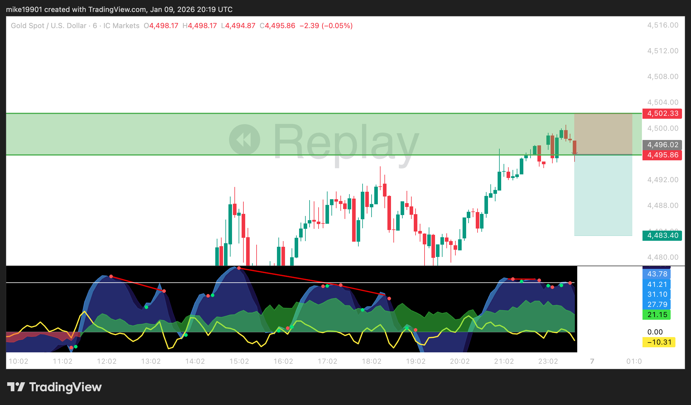

- Is price approaching a **POI**?
- Any **upcoming news** that will affect this trade?
- Are the **HTFs and LTFs** indicating a reversal?
- Is the **stop loss placed above** recent market structure / the POI?
- Is the **profit target placed above** any major market-structure level? *(i.e. clear of obstacles below)*
- Is there **WaveTrend divergence** at the POI (check multiple timeframes)?
- Is **Money Flow green and trending down**?
- Is **VWAP trending down / crossing the zero line**?
- Are the **trading rules** being followed?

> If the checklist is satisfied, it aligns with your idea, and there's no
> upcoming news → **place the trade.**

### 4c. Buy trade checklist

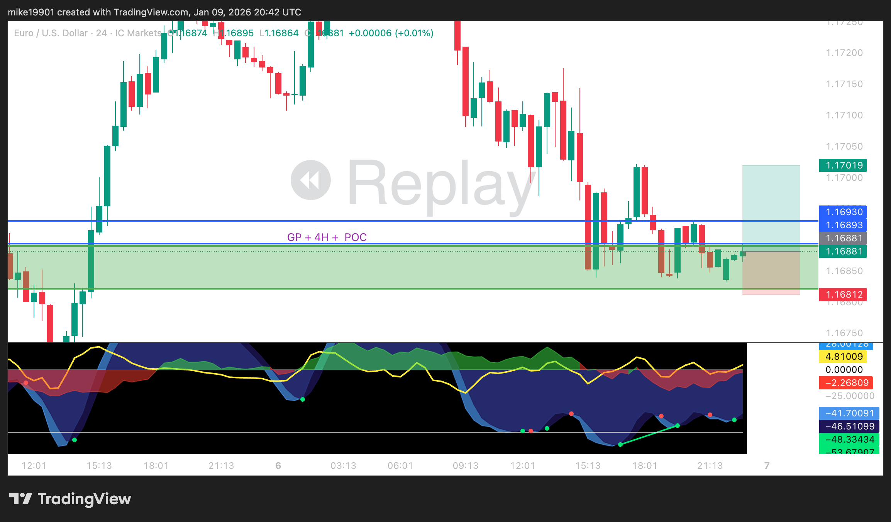

- Is price approaching a **POI**?
- Any **upcoming news** that will affect this trade?
- Are the **HTFs and LTFs** indicating a reversal?
- Is the **stop loss placed** below recent market structure / the POI?
- Is the **profit target placed below** any major market-structure level? *(clear of obstacles above)*
- Is there **WaveTrend divergence** at the POI (check multiple timeframes)?
- Is **Money Flow red and trending up**?
- Is **VWAP trending up / crossing the zero line**?
- Are the **trading rules** being followed?

> If satisfied and no upcoming news → **place the trade.**

---

## Step 5 — Hints, Tips & Additional Information

**Confluence & confirmation**
- More confluences in a POI = **stronger** the area.
- More VuManChu confluences = **stronger confirmation** and higher probability of
  predicting the move.

**News & volatility**
- News (e.g. **NFP**) increases volatility — **avoid trading through it** if
  possible; if not, prioritise **protecting capital**.

**Timeframes**
- Switch between timeframes to gauge market sentiment on HTFs and LTFs.
- Some HTF VuManChu confirmations can be **anticipated by watching the LTFs**.

**False breakouts**
- **Sell/buy stop orders** are ideal for entering during **false breakouts**: if
  price slightly overshoots the level but still shows a reversal, place a stop
  order to execute on the way back down/up. If price doesn't reverse, **cancel the
  order.**

**Trading psychology**
- One or two losses can wreck your mindset — **step away** and return with a clear
  head.
- **Trade within your risk %** — over-risking causes anxiety, micro-managing, and
  blown accounts.
- **Only trade when following the rules** — intuition/gut trading is gambling.

---

## One-paragraph summary

Map the chart with higher-timeframe structure, volume-profile levels (POC / VAH /
VAL / HVN) and Fibonacci retracements. Where several of these **overlap**, box a
**Point of Interest**. Wait for price to reach a POI, then use the **VuManChu**
indicator (volume-wave divergence, VWAP zero-line cross, Money-Flow fade) to
**confirm** a reaction. Enter with a stop beyond the POI/structure and a target at
a chosen **risk-to-reward** ratio, risking a **fixed small % per trade**. Manage
the trade to break-even at 1:1, scale out partials at 1:1 / 1:2 / 1:3, and let a
runner trail. Follow the checklist every time, avoid news spikes, and never
revenge-trade. The genuine edge here is the **risk discipline**, not the entry
signals.
