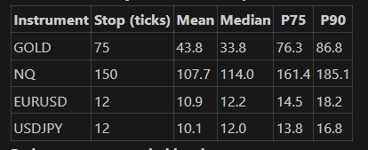

# COG Snippets

Short messages from C.OG (Colez Trades) and the Discord worth keeping: odd answers,
rules of thumb, worked examples. One entry per snippet, newest at the bottom.

Each entry has:
- **the snippet as posted**, verbatim, with names and channel;
- **the explanation**, which is ours and is kept separate so the original stays clean;
- **how it maps to this repo**, where it does.

The longer course material lives in `micro learning bank.md`. This file is for the
one-off messages.

---

## 1. Stop placement from an MAE table: "none of the above" (#Vip-Discussion, 2026-09-26)

**Context:** Jordan (CT) ran an MAE analysis on a forecast's trades and asked C.OG which
statistic to set the stop from: mean, median, P75 or P90.

**The table as posted:**

| Instrument | Stop (ticks) | Mean | Median | P75 | P90 |
|---|---|---|---|---|---|
| GOLD | 75 | 43.8 | 33.8 | 76.3 | 86.8 |
| NQ | 150 | 107.7 | 114.0 | 161.4 | 185.1 |
| EURUSD | 12 | 10.9 | 12.2 | 14.5 | 18.2 |
| USDJPY | 12 | 10.1 | 12.0 | 13.8 | 16.8 |

**Jordan's question:** "Mean median p75 or p90?"

**C.OG's response (verbatim):**

> none of the above xD
>
> The correct approach:
> So model and test in the data what changes does actual yield any predictive power
> That's then going to be your noise threshold
> Anything below that you don't include
> Then past that threshold you're then going to have a noise threshold for each horizon type
> Let's say
> 2 weeks
> 1 month
> 1.5 months
> 2 months
> So on all the way up to maybe 6 or 12 months
> This will then give you a distribution of results so you can can then see what carried the best value

**The analogy that followed (verbatim):**

> The everyday analogy first: imagine you're deciding how many layers of clothing to wear
> tomorrow, and you only get to look at "the weather over the last N days" to decide. Look
> back just 1 day and you might catch a freak warm afternoon and underdress. Look back a
> full year and you'll always get "average" advice that ignores you're actually in the
> middle of a cold snap right now. Somewhere in between is a window long enough to smooth
> out random daily noise, but short enough to still notice "oh, it's actually gotten colder
> this month" before you're shivering. That's exactly the tradeoff being tuned here — just
> for stop-loss distance instead of jacket thickness.

### Reading the table

**MAE (maximum adverse excursion)** is how far each trade went against you, at its worst
point, before it finished. Each row summarises that across all of an instrument's
trades, in ticks:

| Column | What it means |
|---|---|
| **Stop (ticks)** | The stop distance currently in use |
| **Mean / Median** | The average and the middle trade's worst drawdown |
| **P75 / P90** | 75% / 90% of trades had an MAE no bigger than this |

MAE values run past the stop (EURUSD's P90 is 18.2 against a 12-tick stop). That means
it was measured on the **forecast's path**, as if no stop had been hit, which is what you
need for this question.

**Where each current stop sits in its own distribution:**

| Instrument | Stop vs MAE | Roughly how many trades breach the stop | Read |
|---|---|---|---|
| GOLD | 75 ≈ P75 (76.3) | ~25% | The mean (43.8) is far above the median (33.8): most trades barely go against you, a minority go a long way |
| NQ | 150, between median (114) and P75 (161) | ~30–35% | Mean below median: MAE bunches toward the high side |
| EURUSD | 12 ≈ median (12.2) | **~50%** | The stop sits in the middle of normal adverse movement |
| USDJPY | 12 = median (12.0) | **~50%** | Same |

**What stands out:** the FX stops are at the median MAE. Half of all trades, winners and
losers alike, touch the stop at some point. On those two pairs a 12-tick stop is mostly
measuring noise, not being wrong.

**A units caveat:** "ticks" on EURUSD could mean pipettes (0.1 pip, so 12 ticks = 1.2 pips)
or pips. At 1.2 pips the stop sits inside the spread plus ordinary jitter, which would
explain the median MAE landing exactly on it. Worth confirming.

### Why "none of the above"

Picking the mean, median, P75 or P90 treats the stop as a **description** of past
drawdowns. Every percentile is arbitrary unless you know what an adverse move of a given
size **tells you about the trade's outcome**. Two problems with reading the table
directly:

1. **Winners and losers are mixed together.** The useful question isn't "how far do
   trades go against me?" but "beyond what distance does going against me predict the
   trade will lose?" A stop should sit where adverse movement stops being normal noise and
   starts being information. Classic MAE analysis (John Sweeney) splits the MAE of
   **winners** from **losers** for this reason. If winners almost never go beyond X
   against you, a stop just past X cuts losers without killing winners.
2. **One distribution hides the time dimension.** The size of "noise" depends on the
   volatility regime, which depends on how far back you measure.

### What C.OG is describing, step by step

1. **Find the noise threshold.** For a range of stop distances, test in the data whether an
   adverse move of that size changes the trade's expected outcome. Below the threshold,
   adverse moves have **no predictive power**: winners and losers look the same, so it's
   noise and the stop must sit beyond it. Where adverse excursion starts to predict a worse
   outcome is the noise threshold.
2. **Repeat per look-back horizon.** Estimate that threshold from trailing windows of
   2 weeks, 1 month, 1.5 months, 2 months, and so on up to 6–12 months. That's the
   weather analogy: 1 day overreacts to a freak afternoon, a year ignores the cold snap
   you're in.
3. **Compare the distribution of results across horizons.** For each look-back, run the
   strategy with the stop set by that look-back's threshold and look at the whole
   distribution of results (expectancy, drawdown, win rate), not one number. Pick the
   window that carried the best value.
4. **Guard against overfitting.** Choose the window in-sample and confirm it
   out-of-sample. With ~10 windows × 4 instruments tried, some will look good by chance.
   (This last step is ours, not in the message, but it follows the same discipline.)

The natural result is a stop that **adapts**: "k × the recent noise level measured over
the chosen window", rather than a fixed 12 or 75 ticks.

### How it maps to this repo

- Every backtest results card here already exports **MAE per trade** (the house CSVs:
  `Date,Return %,MAE %` and `date,R,MAE (R)`). MAE must come from the real intra-trade
  path (CLAUDE.md). So the raw input for this analysis already exists for every engine.
- **R-multiples** already express MAE in risk units. That's the vol-adjusted version of
  "ticks", so thresholds compare across instruments and regimes.
- **Not yet built:** a stop-distance sweep that finds the noise threshold per look-back
  window and compares expectancy across windows. It would be a natural reusable brick:
  trade log with the MAE path in, noise threshold and results by look-back out.
