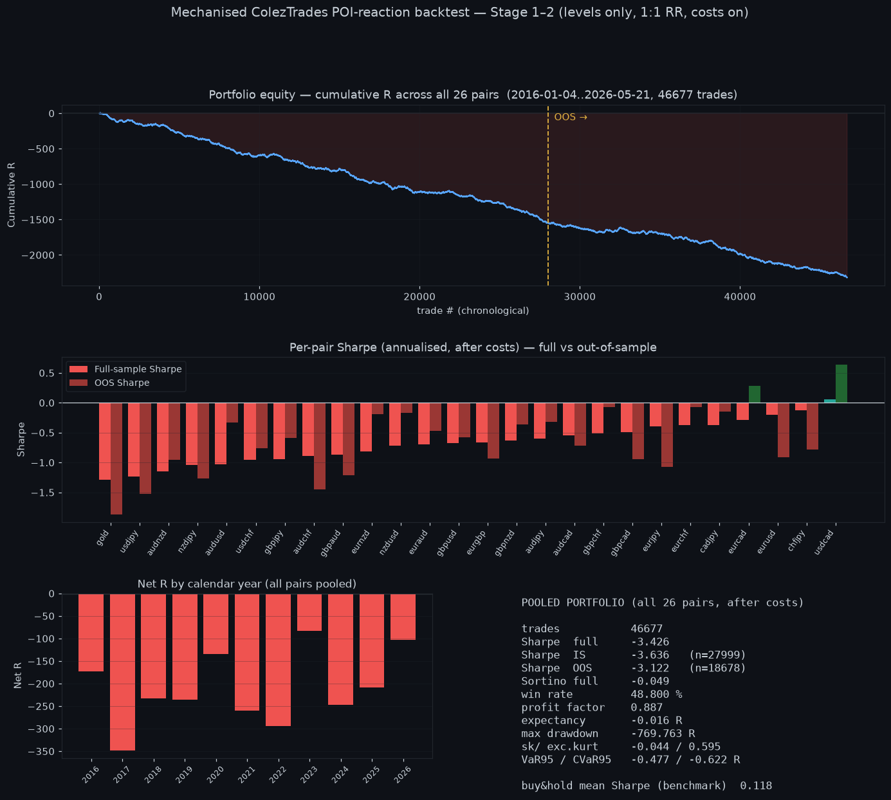
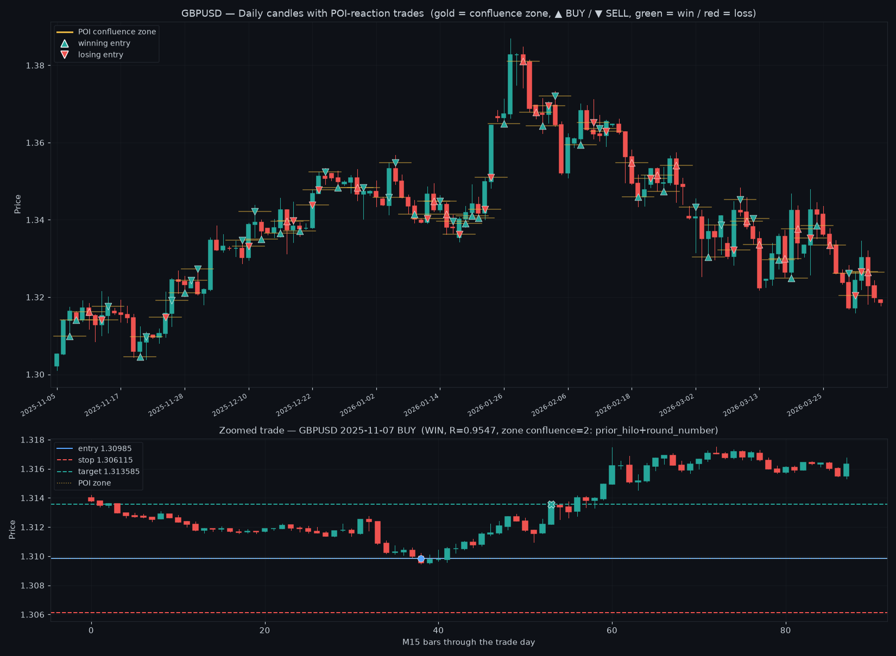

# ColezTrades POI-Reaction Backtest — 26 pairs, 2016–2026

A mechanised backtest of the ColezTrades discretionary strategy
([`docs/ColezTrades_Trading_Strategy.md`](../../docs/ColezTrades_Trading_Strategy.md)),
built to the plan in
[`docs/ColezTrades_Backtest_Build_Plan.md`](../../docs/ColezTrades_Backtest_Build_Plan.md).
Engine: [`js/poiReactionV1Engine.js`](../../js/poiReactionV1Engine.js).

This is **Stage 1–2** of the build plan: the level-confluence "Point of Interest"
(POI) fade with costs on and a true in-sample / out-of-sample split. The VuManChu
confirmation gate (Stage 3) is **not** in this run — Stage 1–2 is the baseline the
gate would have to beat.

---

## Headline result

Across **26 instruments** and **~10.4 years** of M1 data (2016-01-04 → 2026-05-21),
the levels-only POI fade took **46,677 trades** and was **net-negative after
costs**, consistently, in-sample and out-of-sample.

| Metric (pooled, all pairs, after costs) | Full sample | In-sample | Out-of-sample |
|---|---|---|---|
| Trades | 46,677 | 27,999 | 18,678 |
| **Sharpe** (annualised) | **−3.43** | −3.64 | **−3.12** |
| Sortino | −0.05 | — | −0.05 |
| Win rate | 48.8 % | — | 49.2 % |
| Profit factor | 0.887 | — | 0.895 |
| Expectancy | **−0.016 R / trade** | — | −0.015 R |
| Max drawdown | −769.8 R | — | −286.9 R |
| Skew / excess kurtosis | −0.04 / 0.60 | — | −0.17 / 1.05 |
| VaR95 / CVaR95 (per-trade) | −0.48 / −0.62 R | — | −0.50 / −0.65 R |
| **Buy-and-hold benchmark** (mean pair Sharpe) | **+0.12** | | |

- **1 / 26** pairs had a positive full-sample Sharpe (USD/CAD, +0.055); **2 / 26**
  had a positive OOS Sharpe (USD/CAD +0.64, EUR/CAD +0.28). Among 26 tests that is
  chance-level, not a subset edge.
- **Every calendar year (2016–2026) was negative.** No regime rescued it.
- The IS and OOS Sharpe are both strongly negative and close to each other —
  this isn't overfitting that broke out-of-sample; the rule simply has no edge and
  bleeds the spread.

**Read plainly:** mechanised faithfully, the POI-confluence fade is a ~coin-flip
on direction (48.8 % win at 1:1 reward:risk) whose small negative expectancy is
the transaction cost. The test settles it — this baseline has no edge.



*Portfolio equity (cumulative R) declines monotonically through both the
in-sample and out-of-sample periods; per-pair Sharpe is negative for all but
USD/CAD; every year is red.*

---

## Proof of trades

The engine places a **limit fade** at a confluence zone and resolves the stop and
target intrabar on real M1 → M15 bars (stop checked first; a limit's take-profit is
not counted on the fill bar — the no-lookahead fill-bar causality rule from
`walkBars`). Below: GBP/USD over a 130-day window with every trade's POI zone
(gold) and entry (▲ BUY / ▼ SELL, green win / red loss), and one winning trade
zoomed to M15 showing the entry, stop, target and the actual fill → exit path.



*The zoomed 2025-11-07 BUY: price falls into a `prior_hilo + round_number`
confluence zone at 1.30985, the limit fills at the low, and the trade exits at the
+1R target 1.31359. This is a winning example — the point is the mechanics are
honest, not that the edge exists (it doesn't, in aggregate).*

---

## Per-pair results (sorted by full-sample Sharpe)

| Pair | Trades | Full Sharpe | Sortino | Win% | PF | Max DD (R) | Expectancy (R) | IS Sharpe | OOS Sharpe | OOS n | Buy&Hold Sharpe |
|---|--:|--:|--:|--:|--:|--:|--:|--:|--:|--:|--:|
| USD/CAD | 1772 | **+0.055** | +0.00 | 51.7 | 1.01 | −9.2 | +0.001 | −0.29 | **+0.64** | 709 | +0.02 |
| CHF/JPY | 1940 | −0.122 | −0.01 | 50.1 | 0.98 | −15.2 | −0.003 | +0.35 | −0.78 | 776 | +0.61 |
| EUR/USD | 1715 | −0.204 | −0.02 | 50.8 | 0.97 | −17.3 | −0.004 | +0.30 | −0.91 | 686 | +0.12 |
| EUR/CAD | 1880 | −0.284 | −0.02 | 50.7 | 0.95 | −24.1 | −0.005 | −0.61 | +0.28 | 752 | +0.10 |
| CAD/JPY | 1807 | −0.370 | −0.03 | 49.4 | 0.94 | −33.9 | −0.010 | −0.51 | −0.15 | 723 | +0.29 |
| EUR/CHF | 1621 | −0.371 | −0.03 | 51.1 | 0.93 | −12.5 | −0.006 | −0.61 | −0.07 | 649 | −0.27 |
| EUR/JPY | 1978 | −0.396 | −0.03 | 49.2 | 0.94 | −30.1 | −0.009 | +0.06 | −1.07 | 792 | +0.39 |
| GBP/CAD | 1973 | −0.496 | −0.04 | 48.5 | 0.92 | −26.2 | −0.011 | −0.26 | −0.95 | 790 | −0.07 |
| GBP/CHF | 1865 | −0.513 | −0.04 | 50.1 | 0.92 | −24.3 | −0.011 | −0.77 | −0.08 | 746 | −0.31 |
| AUD/CAD | 1790 | −0.542 | −0.04 | 50.2 | 0.91 | −22.4 | −0.011 | −0.43 | −0.71 | 716 | +0.01 |
| AUD/JPY | 1843 | −0.599 | −0.04 | 48.9 | 0.90 | −43.8 | −0.018 | −0.78 | −0.32 | 738 | +0.26 |
| GBP/NZD | 2130 | −0.628 | −0.04 | 48.9 | 0.91 | −34.9 | −0.014 | −0.78 | −0.36 | 852 | +0.09 |
| EUR/GBP | 1616 | −0.660 | −0.05 | 48.5 | 0.89 | −27.6 | −0.013 | −0.53 | −0.93 | 647 | +0.23 |
| GBP/USD | 1873 | −0.674 | −0.05 | 48.7 | 0.89 | −33.9 | −0.016 | −0.74 | −0.57 | 750 | −0.04 |
| EUR/AUD | 2019 | −0.698 | −0.05 | 49.5 | 0.89 | −39.9 | −0.015 | −0.85 | −0.47 | 808 | +0.12 |
| NZD/USD | 1683 | −0.714 | −0.05 | 48.0 | 0.88 | −39.0 | −0.021 | −1.14 | −0.17 | 674 | −0.07 |
| EUR/NZD | 2081 | −0.816 | −0.06 | 47.8 | 0.88 | −37.4 | −0.017 | −1.19 | −0.19 | 833 | +0.25 |
| GBP/AUD | 2110 | −0.871 | −0.06 | 47.2 | 0.87 | −46.1 | −0.020 | −0.69 | −1.21 | 844 | −0.04 |
| AUD/CHF | 737 | −0.889 | −0.06 | 48.6 | 0.85 | −23.0 | −0.024 | −0.46 | −1.46 | 295 | −0.15 |
| GBP/JPY | 2008 | −0.947 | −0.07 | 47.4 | 0.86 | −61.7 | −0.025 | −1.17 | −0.58 | 804 | +0.20 |
| USD/CHF | 1721 | −0.953 | −0.07 | 48.5 | 0.85 | −38.7 | −0.020 | −1.11 | −0.76 | 689 | −0.25 |
| AUD/USD | 1727 | −1.027 | −0.08 | 47.0 | 0.83 | −51.7 | −0.030 | −1.55 | −0.33 | 691 | +0.04 |
| NZD/JPY | 1905 | −1.038 | −0.08 | 46.2 | 0.84 | −57.6 | −0.030 | −0.89 | −1.27 | 762 | +0.17 |
| AUD/NZD | 1804 | −1.143 | −0.08 | 47.3 | 0.82 | −32.5 | −0.018 | −1.26 | −0.95 | 722 | +0.23 |
| USD/JPY | 1850 | −1.230 | −0.09 | 47.4 | 0.81 | −56.0 | −0.029 | −1.03 | −1.53 | 740 | +0.31 |
| XAU/USD (gold) | 1229 | −1.285 | −0.11 | 48.3 | 0.75 | −84.0 | −0.068 | −0.84 | −1.87 | 492 | +0.82 |

Full machine-readable data (per-trade logs in all three house CSV schemas, per-pair
metrics, pooled JSON) is in [`./data/`](./data/).

### Net R by calendar year (all pairs pooled)

| 2016 | 2017 | 2018 | 2019 | 2020 | 2021 | 2022 | 2023 | 2024 | 2025 | 2026* |
|--:|--:|--:|--:|--:|--:|--:|--:|--:|--:|--:|
| −173 | −348 | −233 | −236 | −134 | −259 | −295 | −82 | −247 | −208 | −104 |

*2026 partial (to May).*

---

## Method (so the number is defensible)

- **Data:** OANDA M1 from R2, 26 instruments, 2016-01-04 → 2026-05-21 (~3.7M
  M1 bars/pair). D1 levels are built from the M1 by UTC-day aggregation.
- **POI construction:** `collectLevels` over `daily_open, prior_hilo, pivots,
  swing_sr, swing_fib` (golden pocket), `volume_profile` (POC/VAH/VAL), and
  `round_number`, then `clusterLevels(tol = 8 pips)`; a POI must have
  **≥ 2 distinct level sources** in the cluster (the "more confluences = stronger"
  rule, quantified). Levels for day *D* use **only** D1 bars and the prior-5-day
  volume profile strictly **before** *D* (no lookahead).
- **Entry:** the POI nearest the day's open is **faded** — limit BUY if the zone
  is below the open, limit SELL if above — on M15 bars, filled by the shared
  `walkBars` primitive (stop checked first; limit take-profit not counted on the
  fill bar).
- **Risk:** stop = 0.5 × D1 ATR(14) beyond the zone; target = **1:1** (fixed).
  One trade per pair per day (first/nearest zone). The R unit is the per-trade
  stop distance (vol-scaled, so R ≠ % return — no degenerate column).
- **Costs:** round-trip **0.012 %** of price for FX, **0.020 %** for gold
  (spread + commission), deducted from every trade's gross return.
- **Split:** last 40 % of the timeline (from 2022-04-13) is out-of-sample.
- **Metrics:** `summarizeSplit` / `summarizeTrades` / `sortinoRatio` from the
  shared metrics brick — one definition of Sharpe/DD/PF/skew/kurt/VaR/CVaR.

### Known limitations (what this run does and doesn't say)

- It tests **Stage 1–2** (levels + confluence). It does **not** yet test the
  VuManChu confirmation gate (Stage 3), which is the deck's actual entry trigger.
  This result is the honest **baseline** that gate must beat to justify itself.
- Direction rule is a simple "fade the nearest zone." The `dayTypeScore`
  fade-vs-follow selector and false-breakout stop entries (Stage 4) are not on.
- One-trade-per-day, fixed 1:1 RR, fixed ATR stop — deliberately low-degree-of-
  freedom so the number can't be fit. No path-dependent management (BE/partials/
  trailing — Stage 5) yet.
- OANDA "volume" is tick count, not real volume, so the volume-profile POC/VAH/VAL
  are tick-volume proxies.

---

## Reproduce

```bash
# per-pair (isolated processes keep memory bounded):
node scripts/run_one.mjs <pair> <outdir>        # e.g. eurusd
# aggregate + CSVs + heatmap:
node scripts/aggregate.mjs <pairoutdir> <outdir>
# charts:
python3 plot_summary.py results.json equity.json summary.png
python3 plot_proof.py   proof_data.json trade_proof.png
```

The engine (`js/poiReactionV1Engine.js`) is pure and composes existing bricks
(`levelSources`, `barUtils`, `forecastCore.walkBars`, `instrumentRegistry`); the
runner/aggregator/plot scripts used for this report are archived alongside this
note's data.

---

## Bottom line

The mechanised ColezTrades POI-reaction fade — levels + confluence, 1:1, costs on
— returns **no edge** over 26 pairs and 10 years: pooled Sharpe −3.4, negative in
every year, positive on only 1/26 pairs, and beaten by a naive buy-and-hold
benchmark. The next honest step (if pursued) is **Stage 3**: add the VuManChu
confirmation gate and measure whether it moves the OOS number off this floor — not
to add tunable knobs to this baseline, which has nothing to tune toward.
