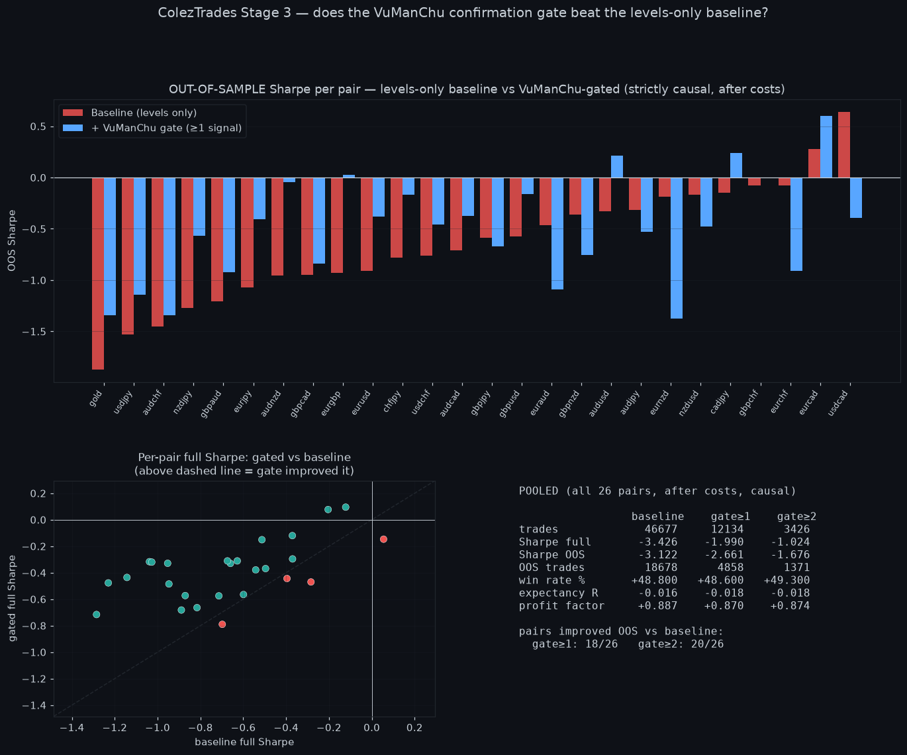

# Stage 3 — Does the VuManChu confirmation gate beat the levels-only baseline?

Follow-up to [`COLEZTRADES_POI_BACKTEST.md`](COLEZTRADES_POI_BACKTEST.md). Stage 1–2
(levels + confluence POI fade) was net-negative: pooled OOS Sharpe −3.1, expectancy
−0.016 R/trade. Stage 3 adds the deck's actual entry trigger — the **VuManChu
confirmation gate** — and asks whether it moves that floor.

Engine: [`js/poiReactionV1Engine.js`](../../js/poiReactionV1Engine.js) with
`gate:true` (opt-in; default off keeps Stage 1–2 byte-identical). The gate requires
**≥ `gateMinSignals` of three** confirmations at the touch, reusing the shared
bricks (no re-inlined math):
1. **WaveTrend regular divergence** of the matching bias — via `divergenceCore.reversalDecision` on the `vumanchuCore` WaveTrend signal line.
2. **VWAP oscillator** turning toward the zero line in the trade direction — `vumanchuCore.computeVWAP`.
3. **Money Flow** in the opposing colour and fading toward zero — `vumanchuCore.computeMoneyFlow`.

Gate parameters are VuManChu defaults (5-bar fractal, OB/OS ±53) — **not fit to
this data**; the only lever is `gateMinSignals` (1 or 2), and both are reported.

---

## First, an honest correction (why the first number was a lie)

The first gated run showed a **spectacular flip: pooled OOS Sharpe −3.1 → +2.2**,
25/26 pairs improving. That was **too good, and it was wrong** — a lookahead bug.
The gate window included the **touch bar itself**, so the VWAP/Money-Flow slope read
that bar's *close*. But the limit fills **mid-bar**, before the close exists — a
~15-minute intrabar peek at information not yet available at entry.

Fixing it (gate reads only bars **fully completed before** the touch) collapsed the
result. This is logged here deliberately: a folklore strategy suddenly printing
Sharpe +2.2 is the cue to hunt for lookahead, not to celebrate. The number below is
the causal one.

---

## Result (strictly causal, after costs)

| Pooled, all 26 pairs | Baseline (levels) | Gate ≥1 signal | Gate ≥2 signals |
|---|--:|--:|--:|
| Trades | 46,677 | 12,134 | 3,426 |
| Sharpe (full) | −3.43 | −1.99 | −1.02 |
| **Sharpe (OOS)** | **−3.12** | **−2.66** | **−1.68** |
| OOS trades | 18,678 | 4,858 | 1,371 |
| Win rate | 48.8 % | 48.6 % | 49.3 % |
| **Expectancy (R/trade)** | **−0.016** | **−0.018** | **−0.018** |
| Profit factor | 0.887 | 0.870 | 0.874 |

### The Sharpe "improvement" is a trade-frequency artifact, not edge

The pooled Sharpe looks better (−3.4 → −1.0 as the gate tightens), but that is
**mostly annualisation, not better trades.** The gate trades ~4× (≥1) to ~14× (≥2)
less often, and per-trade Sharpe annualises by trade frequency — so the *same*
negative per-trade expectancy produces a smaller annualised number. The
frequency-independent metrics show **no edge added**:

- **Expectancy per trade: −0.016 → −0.018 R** — flat-to-slightly-**worse**, not better.
- **Win rate: 48.8 % → 48.6 %/49.3 %** — unchanged (still a coin-flip).
- Per-trade expectancy improved on only **13/26** pairs (coin-flip), and was
  **positive on just 2/26** (chance-level among 26 tests).
- Win rate improved on only **11/26** pairs.
- OOS Sharpe is a scatter around a still-negative centre: some pairs flip positive
  (AUD/USD, CAD/JPY, EUR/CAD), but others get **worse** — notably USD/CAD, the one
  baseline winner, went **+0.64 → −0.39** with the gate.

The "18–20/26 pairs improved OOS Sharpe" headline is the same annualisation effect
plus noise; on the metric that actually says "is each trade profitable"
(expectancy), it's 13/26 — nothing.

---

## Verdict — Stage 3 is NULL

**The VuManChu confirmation gate does not turn the POI fade profitable.** It filters
*volume* (trades ~4–14× less), not *losers*: per-trade expectancy stays negative and
essentially unchanged, win rate stays ~49 %, and pooled OOS Sharpe stays firmly
negative (−2.66 / −1.68). Trading less of a negative-expectancy strategy loses less
in aggregate, but that is money management on a broken entry, not an edge.

Combined with Stage 1–2, the honest conclusion for the mechanised ColezTrades
strategy is: **neither the level-confluence POI nor the VuManChu confirmation, alone
or together, shows a tradeable edge on 26 pairs over 2016–2026 after costs.**

The reusable by-products stand regardless: the `collectLevels → walkBars`
POI-reaction harness, the opt-in causal VuManChu gate (now with the lookahead
removed), and the confirmation that `divergenceCore` + `vumanchuCore` compose
cleanly into a strategy gate.

### What could still be tried (not pursued here)
- Stage 4 (false-breakout **stop** entries; `dayTypeScore` fade-vs-follow selector).
- Different exits (the fixed 1:1 RR is arbitrary) — but per-trade expectancy being
  negative *before* exit tuning means exit changes would be fitting, not finding.
- Higher-timeframe VuManChu (the deck anticipates HTF signals from LTF) — a genuine
  variant, though the low-DOF causal test here already covers the core claim.

Data: `data/gate_ab.csv` (per-pair base vs ≥1 vs ≥2) and `data/results_gate.json`.
