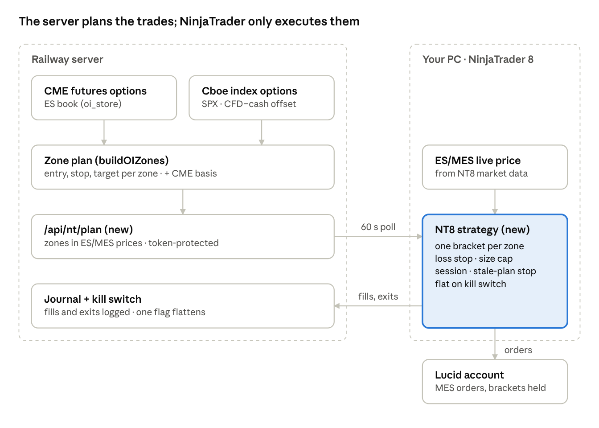

# Bot → NinjaTrader Automation: Build Proposal

Oct 9, 2026 · Rich · status: **proposal, nothing built** · living copy: [Claude doc](https://claude.ai/code/artifact/fa4c4c81-f837-46d6-a539-5a341f4a50b2)

## Summary

We connect the MacroFX server to a NinjaTrader 8 strategy that trades MES/ES on the Lucid account, built in six phases with nothing live until the levels pass a test. The server already produces the levels: CME and Cboe walls, max pain, the GEX flip, and futures-terms prices. The missing pieces are a signal endpoint, a small NinjaScript (C#) strategy on your PC, and the risk rails a prop account needs.

- **First deliverable, about a week:** a display-only NT8 indicator that draws the server's levels on your futures chart. No orders.
- **Gate before any order:** the Cboe-vs-CME placebo test (about 4–6 weeks of tracked data), then at least 4 weeks on the NT8 Sim account.
- **Gate before the Lucid account:** confirmation that Lucid's rules allow an automated NinjaTrader strategy.

## Constraints and facts

The Lucid account trades through NinjaTrader, so the bot has to end in an NT8 strategy. A direct API is unlikely to be available on a prop account.

| Topic | What we know | What it means |
| --- | --- | --- |
| Account | Lucid prop account, runs on Tradovate / NinjaTrader 8 | Orders must go through NT8 on your PC |
| Tradovate API | Needs API access on your own account; prop accounts usually don't get it | Not the route unless Lucid confirms otherwise |
| IBKR | Ruled out by you | No IBKR code in this build |
| NinjaScript | NT8 strategies are C#, compiled inside NT8 | One small C# strategy; the Python bots stay as they are |
| Current OI bot | `oi_bot/oi_bot.py` executes the server's `oi_bot_zones` plan (entry, stop, target); brokers are Paper and MT5 | The NT8 strategy copies this executor role and never computes levels |
| Prices | Zones are in CFD terms today; futures terms add the CME basis; Cboe levels are 15-min delayed with a measured CFD−cash offset | The NT8 feed needs ES/MES-priced zones from the server |
| Prop rules | Lucid's automation, session and drawdown rules not yet confirmed | Must be confirmed before Phase 5 |

## Architecture

The server keeps every decision (levels, direction, stop, target); the NT8 strategy only watches the ES/MES price and executes the plan. This is the same split as today's `oi_bot.py`, so there is no second copy of the trading logic to drift.

The strategy polls one new endpoint every 60 s, places a broker-held bracket when price reaches a zone, and reports each fill back to the server's journal. Contract roll (ESZ6 to ESH7 around 10 Dec) is handled by the endpoint naming the front contract, so the strategy never hard-codes one.

Open choice: a native NinjaScript executor (assumed here), or keep the Python bot as the trader and have it drop order files into NT8 through the Automated Trading Interface.

## Build plan

Six phases; each ends at a gate, and a failed gate stops the build there rather than moving on.

0. **Confirm the rules** (you, about 1 day). Ask Lucid whether an automated NinjaTrader strategy is allowed, in which hours, and with what limits.
   - Gate: written yes from Lucid, or the plan stops at Phase 3 (indicator and Sim only).
1. **Futures-terms plan endpoint** (server, 1–2 days). `GET /api/nt/plan?fut=ES&src=cboe|cme` returns the OI bot's zones in ES/MES prices, with an as-of time, the basis used and a plan ID.
   - It reuses `buildOIZones`, the futures-terms conversion and the Cboe overlay; no new level logic.
   - Protected by a token, so only your NT8 can read it.
   - Gate: the endpoint's prices match the export's futures-terms lines for the same moment.
2. **NT8 levels indicator** (C#, 2–3 days). Polls the endpoint every 60 s and draws the zones on your ES/MES chart. No orders.
   - Gate: a week of you checking the lines against the dashboard.
3. **NT8 executor strategy on Sim** (C#, about 1 week). The same executor rules as `oi_bot.py`: one bracketed order per zone touch, the plan's stop and target, MES, NT8 Sim account only.
   - Every fill and every exit is reported back to the server for the journal.
   - Gate: the placebo test has passed, and the Sim results go into the forward test (Phase 4).
4. **Sim forward test** (4+ weeks, no build). Runs untouched on Sim; the server compares Sim fills with the plan and with the OANDA paper bot.
   - Gate: the pre-registered criteria in "Testing and go-live gates" are met.
5. **Lucid, 1 MES** (2+ weeks). The same strategy on the Lucid account at one micro contract, with every rail switched on.
   - Gate: no rule breach, and results inside the Sim range. Size changes only after that.

## Risk controls

Every rail lives inside the NT8 strategy, so it holds even if the server or the internet connection fails. The prop account's own limits always sit tighter than Lucid's.

| Rail | Rule | Why |
| --- | --- | --- |
| Daily loss stop | Flatten and stop for the day at 50% of Lucid's daily limit | A breach can end the account |
| Trailing drawdown guard | Stop trading when within 25% of Lucid's max drawdown | Same, on the overall limit |
| Size cap | 1 MES until Phase 5 passes; hard maximum set in the strategy | No runaway sizing from a bad plan |
| One position at a time | No new entry while a position or working order exists | Mirrors `oi_bot.py` |
| Broker-side bracket | Stop and target placed with the entry, held at the broker | A crashed PC still has a stop working |
| Session window | Trades only inside the hours you and Lucid allow; flat before the close | Prop overnight rules; thin markets |
| News blackout | No new entries around high-impact events, from the server's event-blackout service | Gap risk through stops |
| Stale plan | No new entries if the plan is older than 15 min or the basis is flagged stale | Old levels sit in the wrong place |
| Connection loss | No new entries while the server is unreachable; open trades keep their bracket | Never trade blind |
| Kill switch | A server flag and an NT8 button both flatten and stop | One-tap stop from phone or desk |

The percentages are starting points to agree with you once Lucid's limits are confirmed.

## Testing and go-live gates

No real order goes out until three tests have passed in order. Each test's pass rule is written down before its data is looked at, the same way as the repo's earlier pre-registered tests.

| Gate | Test | Pass rule (to pre-register) | Earliest |
| --- | --- | --- | --- |
| 1. Levels have an edge | Placebo test on tracked Cboe levels (SPX500, NAS100) vs neighbour and random levels, 5-min bars | GEX walls stall price more often than placebo levels at the pre-registered significance | ~25 sessions of `cboe_snap_v1` |
| 2. Executor works | NT8 Sim: fills, brackets, rails, reconnects, roll | Zero missed stops; every fill journalled; fills within the plan's slippage allowance | 1 week on Sim |
| 3. Edge survives costs | Sim forward test on MES with commissions and slippage | Positive expectancy after costs, max drawdown inside the Lucid limit with the rails on | 4+ weeks on Sim |
| 4. Live behaves like Sim | Lucid, 1 MES | No rule breach; results inside the Sim range | 2+ weeks live |

If gate 1 fails, the NT8 work stops at the indicator (Phase 2). The levels still help on the chart, but there is nothing to automate.

## Open questions

- [ ] Does Lucid allow a fully automated NinjaTrader strategy on your account type, and in which hours?
- [ ] What are the account's daily loss and max drawdown limits, and is the drawdown trailing or static?
- [ ] How does your NT8 connect to Lucid: Tradovate, or Rithmic?
- [ ] Which contract: MES only to start, or ES as well later?
- [ ] Which levels feed the plan: Cboe for SPX/NDX with CME as the fallback, or CME only?
- [ ] Does the NT8 PC stay on all session, or should the strategy run on a Windows VPS?
- [ ] Should NQ/MNQ follow SPX once ES is proven, or stay out of scope?
- [ ] Native NinjaScript executor, or the Python bot dropping order files into NT8 (ATI)?
